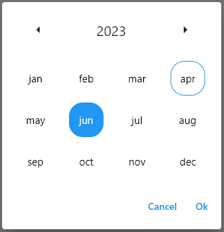
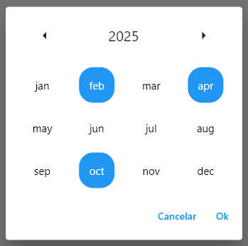

# Month selector

A package that allows the user to select a month and a year on a calendar, without the need to specify a specific day. It returns a Dialog that allows the user to select one or more months.

## Features

Selection of one or several months on a calendar;
Multi-selection of months, allowing the selection of months from different years;
Customizable to meet specific needs of different projects;

### Screenshots

<p align="center">
    
    
</p>

## How to use

Add the ``MonthSelector` widget to your code.

### Example

```dart
            showDialog(
                context: context,
                builder: (context) {
                  return MonthSelector(
                    callback: (res) {
                      Navigator.pop(context);
                      if (res != null && res != []) {
                        setState(() {
                          month = res[0];
                        });
                      }
                    },
                  );
                });
```

### Parameters list

These are the main parameters to be configured:

`callback`: defines a function to be called when the user selects one or more dates.

`selectedDate`: defines the dates that will be selected when the calendar is opened.

`firstDate`: defines the earliest selectable date.

`lastDate`: defines the latest selectable date.

`multiSelection`: allows the selection of multiple dates

`months`: defines the month strings displayed on the calendar.


## Contributions:
[Darice Sousa](https://github.com/daricesousa)
